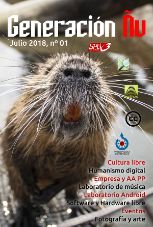

# Portada

### Encuéntranos en twitter: [@**GeneracionNu**](https://twitter.com/GeneracionNu)

### Otros idiomas



[Número 00 en Galego](https://xeracion-gnu.gitbook.io/xeracion-gnu-00/)



[Number 00 in English](https://xeracion-gnu.gitbook.io/gnu-generation-00-en/)​



## Generación Ñu \#00-es {#xeracion-nu-00-gl}

### Otros números

[Número 01](https://xeracion-gnu.gitbook.io/generacion-gnu-01-es/)

### [Editorial](editorial.md)

