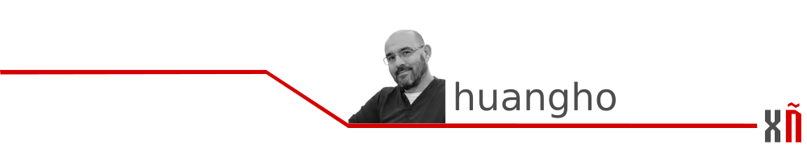

# Desde una habitación sin ventanas

Sonaba de forma compulsiva en la radio de aquella clínica de Manhattan el éxito ["Mama, he treats your daughter mean"](https://www.youtube.com/watch?v=HnmbJruEkKw), mientras Daniel acariciaba con la yema de sus dedos aún temblorosos al bebé que, instantes antes la sonriente enfermera había situado delicadamente en el regazo de una exhausta y feliz Alice.

Aún no se sabía entonces que aquel futuro biólogo vocacional, con cierto talento para la matemática y el razonamiento lógico que se habría de matricular en Harvard buscando una titulación en física, había de enfrentarse a alguno de sus propios compañeros de trabajo, fundadores de la hoy ya desaparecida Symbolics Inc¹, para impedir que tomasen el control de los ordenadores del MIT Computer Science & Artificial Intelligence Lab², bajo la poco elegante táctica empresarial de acompañar la correcciones y mejoras del sistema operativo de máquinas Lisp³ de una cláusula prohibiendo redistribuir estas modificaciones, lo que irremediablemente desembocaría, treinta años después del lanzamiento del éxito de Ruth Brown, un 27 de septiembre de 1983, en la primera piedra del proyecto GNU, que perseguía la creación de un sistema operativo completamente libre.

Un par de años después se publicó el [Manifiesto GNU](https://www.gnu.org/gnu/manifesto.es.html) en el que Richard, el hijo de Alice Lippman y Daniel Stallman, declaraba sus intenciones y motivaciones para crear una alternativa libre al sistema operativo Unix, al que denominó GNU. Un acrónimo recurrente, como Bing \(Bing it's not Google\), de reafirmación de lo que no se es, en este caso, esta claro que lo que no es, es UNIX.

En este escrito también establecía la desambiguación de la fonética del nombre que había empezado a crear controversia entre sus seguidores, ¿como se pronuncia GNU?.  
Así supimos de los antílopes artiodáctilos. Una especie fascinante, maravillosos actores de reparto en los documentales de fauna salvaje en las sobremesas de verano, más en concreto merece mención el [connochaetes gnou](https://es.wikipedia.org/wiki/Connochaetes_gnou) o ñu negro. Seguro que a Richard Matthew, el biólogo vocacional, le gustaría esta afirmación. 

Otros planteamientos de la citada declaración sentaban las bases de este movimiento social que va mucho más allá de un sistema operativo y se enraíza con los principios más básicos de en que sociedad deseamos vivir, que sociedad deseamos construir, que sociedad deseamos ser, en toda la amplitud del verbo.

Y hablando de verbos, en concreto de los verbos anglosajones, que como en cualquier otra lengua, y este dialecto anglofrísio traído a Britania por los invasores Germanos no podía ser de otro modo, tiende a la economía del lenguaje.  
Así en la interpretación que de palabras como 'free' se hace, caben más de veinte matices o significados entre los que pueden, con suma facilidad, confundirse libre y gratis. Pero aquí no vamos a hablar de costes, hablamos de libertades. Las libertades que los usuarios y la comunidad merecen tener, la libertad de ejecutar, copiar, intercambiar, estudiar, modificar y mejorar un programa.  
Pero también, como mencionábamos antes, de la corriente de pensamiento que promueve esta libertad del contenido libre, de la cultura libre, que se articula en torno a conceptos como dominio público, licencias Creative Commons o Copyleft. 

¿Te llama la atención?, ¿deseas saber más?. Adéntrate conmigo, paso a paso en este camino, y de la mano de gente que ha hecho de estos nobles principios bandera, recorriendo los infinitos hilos de la comunidad, probando, preguntando hasta hallar las respuestas a todas nuestras inquietudes a los largo de una serie de artículos en que profundizaremos en la cultura y el software libres, las distribuciones, el cine libre, la música libre y el hardware libre. Aprenderemos, y de este modo, tal vez, sólo tal vez, aunque por un instante nos sentiremos del mismo modo.

### Notas

• El primer dominio de internet. [http://symbolics.com/](http://symbolics.com/)  
• Investigación en Inteligencia Artificial, Biología computacional. Robótica. etc  
• Lisp: Procesamiento de listas. "LISt Processor"

### [Siguiente artículo](empresas-explotadoras-que-less-than-less-than-no-salen-del-armario-greater-than-greater-than.md)

